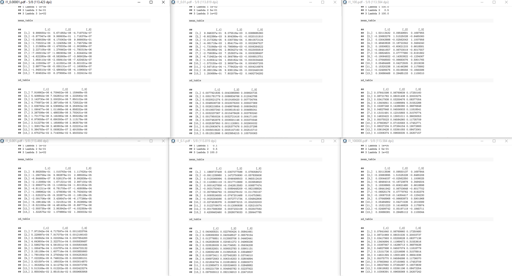
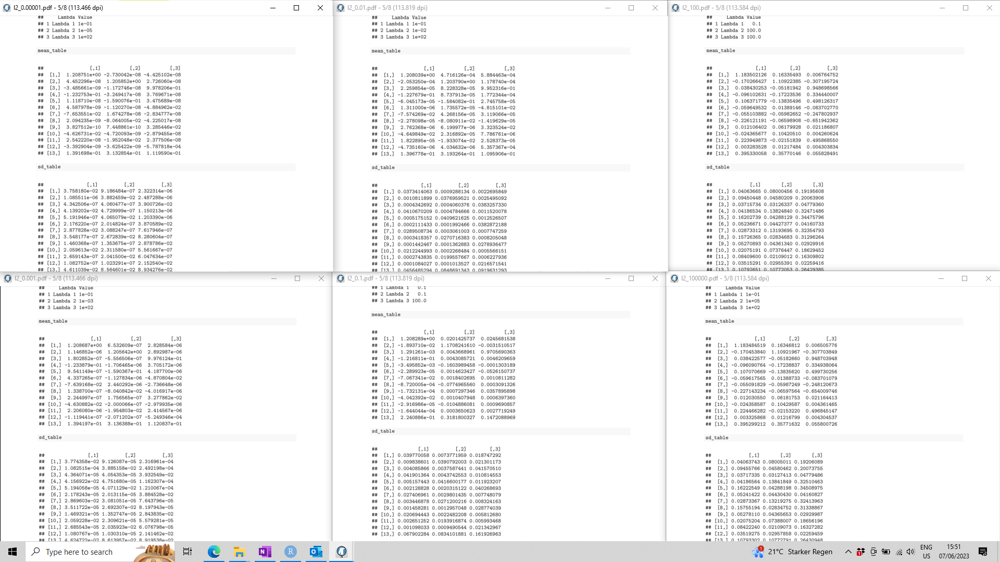
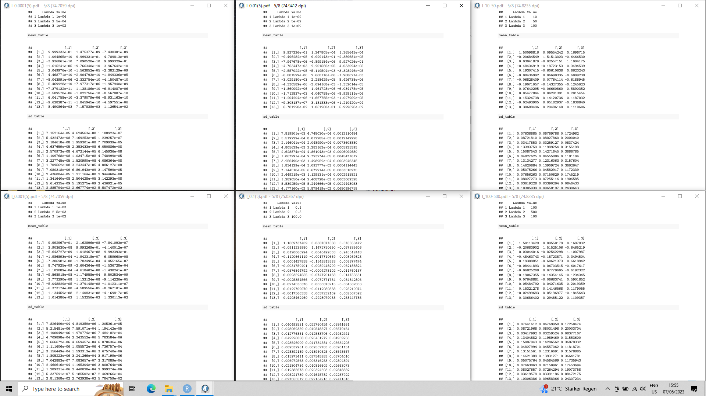
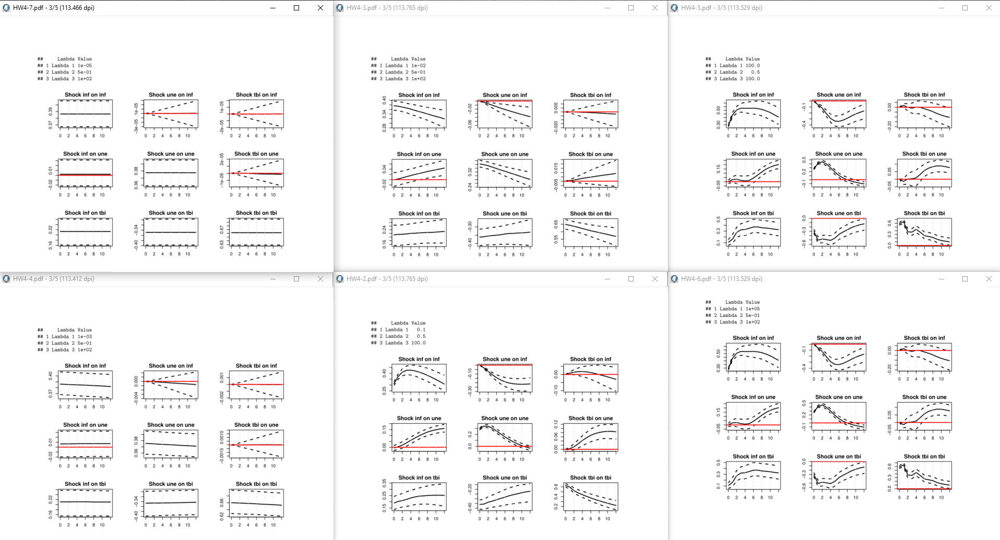
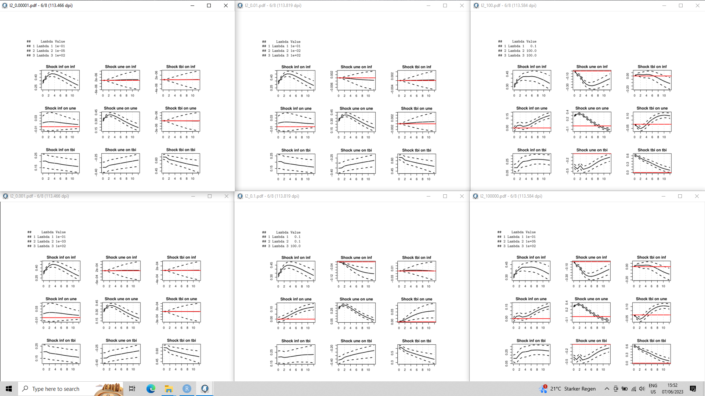
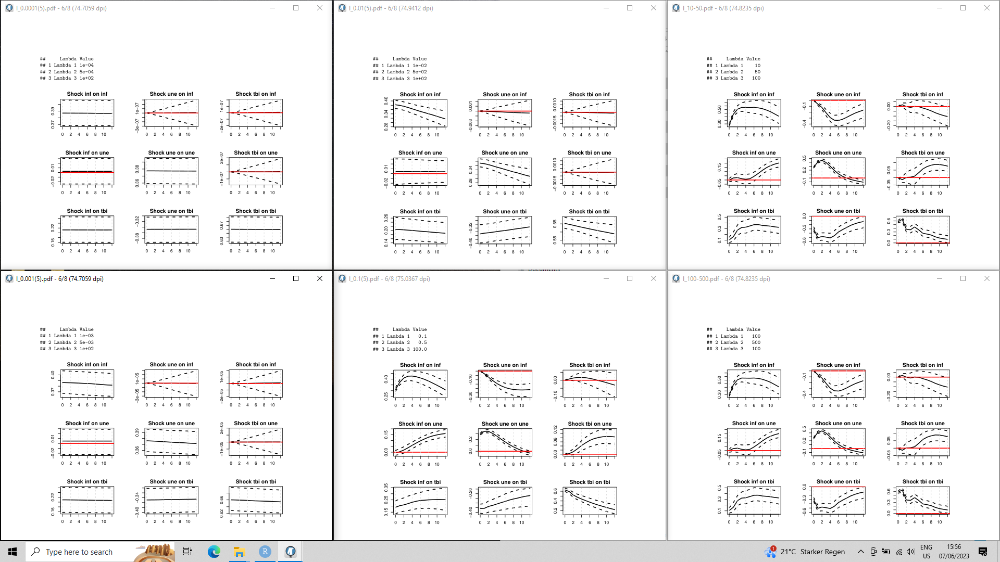
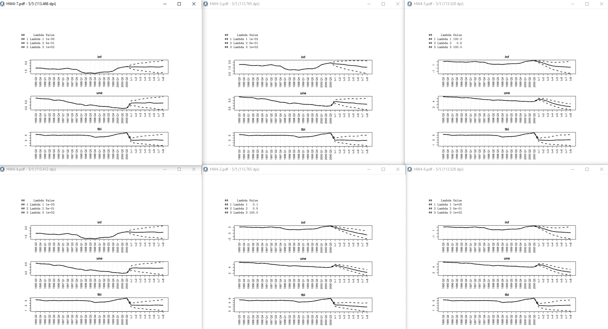
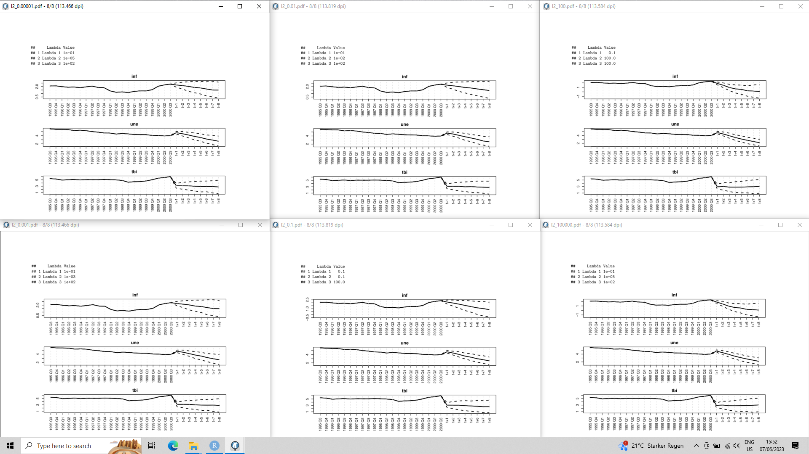
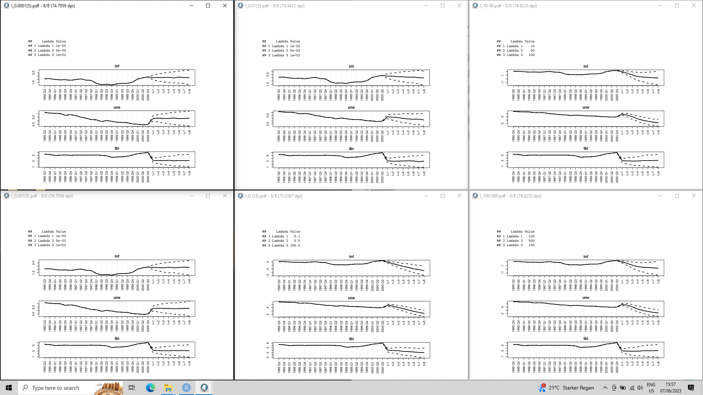

```{r setup, include=FALSE}
knitr::opts_chunk$set(echo = TRUE)
```

{ width=100% }

{ width=100% }

{ width=100% }


{ width=100% }

{ width=100% }

{ width=100% }


{ width=100% }

{ width=100% }

{ width=100% }